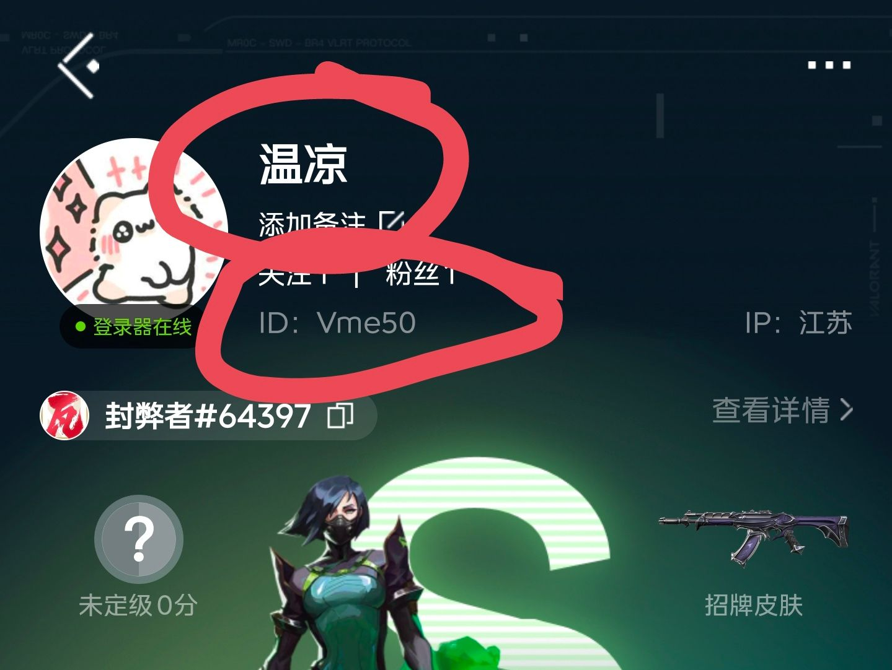

<!-- markdownlint-disable MD033 -->
# VALUID

  

<h1 align = "center">VALUID 0.1.0</h1>
<h4 align = "center">🚧支持QQ群/频道、OneBot、微信、KOOK、Tg、飞书、DoDo、Discord的无畏契约Bot插件🚧</h4>

        <a href="http://docs.gsuid.gbots.work/#/" target="_blank">安装文档</a>

## 丨安装提醒

> **注意：该插件为[早柚核心(gsuid_core)](https://github.com/Genshin-bots/gsuid_core)的扩展，具体安装方式可参考[GenshinUID](https://github.com/KimigaiiWuyi/GenshinUID)**
>
> 支持 NoneBot2 & HoshinoBot & ZeroBot & YunzaiBot & Koishi 的无畏契约国服 Bot 插件

## 丨安装方式(未支持)

1. 发送`core安装插件VAUID`
2. 发送`gs重启`应用插件

## 丨功能

### 一般功能

- va查询
- va搜索
- va绑定uid
- va查询uid
- va切换uid

### 管理员功能

- va添加ck
- va添加uid

## 丨使用方式

1. 安装插件
2. 使用**小号**打开**掌上无畏契约**
3. 抓取 ck，参数包括`userId`和`tid`
4. 抓取`uuid`
5. 私聊bot，添加ck和uid
6. 发送`va搜索`查询玩家信息,查询内容参考如图片的两个都可以

7. 发送`va绑定uid`绑定uid
8. 发送`va查询uid`查询uid

## to do

- [ ] 添加对局记录查询
- [ ] 优化图片
- [ ] 集市/个人皮肤查询
- [ ] 瓦罗兰特港/其他服查询

## 丨其他

- 本项目仅供学习使用，请勿用于商业用途
- [GPL-3.0 License](https://github.com/Agnes4m/VAUID/blob/master/LICENSE)
- 数据来源于马服无畏契约,侵删
